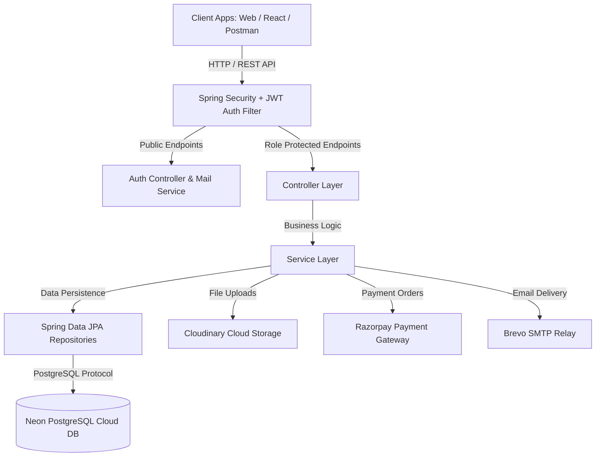
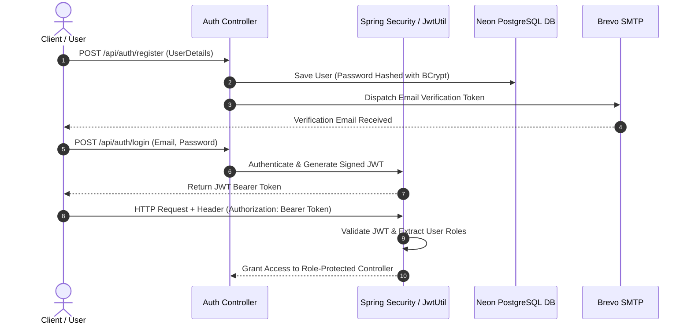

#  Hospital Management System Backend (Spring Boot 3.x + Java 21)

[](https://www.oracle.com/java/)
[](https://spring.io/projects/spring-boot)
[](https://neon.tech/)
[](https://jwt.io/)
[](http://localhost:8080/swagger-ui.html)
[](https://www.docker.com/)

A production-ready, enterprise-grade **Hospital Management System Backend** built with **Spring Boot 3.x** and **Java 21**. It delivers RESTful APIs for handling user authentication, patient onboarding, doctor scheduling, appointments, digital prescriptions, electronic health/medical records, itemized billing, online **Razorpay** payments, **Cloudinary** document/image management, and automated **Brevo SMTP** email notifications.

---

##  System Architecture & Flowchart

### 1. High-Level Architecture Diagram



---

### 2. Authentication & Authorization Sequence Diagram



---

### 3. Patient Appointment, Prescription & Billing Workflow

```mermaid
workflow
    direction TB
    A[Patient / Receptionist: Book Appointment] --> B[Doctor: Confirm & Conduct Consultation]
    B --> C[Doctor: Issue Digital Prescription]
    B --> D[Doctor: Record Clinical Diagnosis & Lab Reports]
    C & D --> E[Receptionist / System: Generate Itemized Hospital Bill]
    E --> F[Patient / Receptionist: Initiate Online Razorpay Payment]
    F --> G[System: Verify Payment Signature & Mark Bill PAID]
    G --> H[Brevo SMTP: Dispatch Payment Confirmation Email]
```

---

##  Role-Based Access Control (RBAC)

The system enforces strict **Role-Based Access Control (RBAC)** across 4 roles: `ADMIN`, `DOCTOR`, `PATIENT`, and `RECEPTIONIST`.

| Role | Responsibilities & Access Rules | Authorized Endpoints |
| :--- | :--- | :--- |
|  **ADMIN** | System governance, department management, doctor onboarding, user account activation/deactivation, and overall revenue analytics. | Full access to `/api/admin/**`, `/api/departments/**`, `/api/doctors/**`, and `/api/dashboard/**`. |
|  **DOCTOR** | Managing assigned appointments, issuing prescriptions, recording clinical diagnoses, and uploading medical test reports. | Access to `/api/appointments/doctor/**`, `/api/prescriptions/**`, `/api/medical-records/**`, `/api/files/upload/report`. |
|  **PATIENT** | Self-registration, booking appointments, viewing medical history & prescriptions, paying bills online via Razorpay. | Access to `/api/appointments/**` (booking/cancelling), `/api/prescriptions/patient/**`, `/api/medical-records/patient/**`, `/api/payments/**`. |
|  **RECEPTIONIST** | Front-desk patient registration, booking walk-in appointments, generating hospital bills, and processing counter payments. | Access to `/api/patients/**`, `/api/appointments/**`, `/api/bills/**`, `/api/payments/**`. |

---

##  Complete REST API Reference

###  1. Authentication & Security (`/api/auth`)
| Method | Endpoint | Access | Description |
| :--- | :--- | :--- | :--- |
| `POST` | `/api/auth/register` | Public | Register a new user (`ADMIN`, `DOCTOR`, `PATIENT`, `RECEPTIONIST`). |
| `POST` | `/api/auth/login` | Public | Authenticate user credentials and return JWT Bearer Token. |
| `GET` | `/api/auth/verify-email` | Public | Verify user email via verification token. |
| `POST` | `/api/auth/forgot-password` | Public | Dispatch password reset token to user email via Brevo. |
| `POST` | `/api/auth/reset-password` | Public | Reset account password using token. |
| `GET` | `/api/auth/profile` | Authenticated | Retrieve authenticated user profile. |

---

###  2. Department Management (`/api/departments`)
| Method | Endpoint | Access | Description |
| :--- | :--- | :--- | :--- |
| `POST` | `/api/departments` | `ADMIN` | Create a new hospital department. |
| `GET` | `/api/departments` | Authenticated | List all hospital departments. |
| `GET` | `/api/departments/{id}` | Authenticated | Fetch department details by ID. |
| `PUT` | `/api/departments/{id}` | `ADMIN` | Update department name or description. |
| `DELETE` | `/api/departments/{id}` | `ADMIN` | Delete department (guarded against assigned doctors). |

---

###  3. Doctor Management (`/api/doctors`)
| Method | Endpoint | Access | Description |
| :--- | :--- | :--- | :--- |
| `POST` | `/api/doctors` | `ADMIN` | Register new doctor profile linked to department. |
| `GET` | `/api/doctors` | Authenticated | Paginated list of all doctors. |
| `GET` | `/api/doctors/{id}` | Authenticated | Get doctor details by ID. |
| `GET` | `/api/doctors/department/{id}`| Authenticated | Get doctors operating under a specific department. |
| `PUT` | `/api/doctors/{id}` | `ADMIN` | Update doctor consultation fee or availability. |
| `DELETE` | `/api/doctors/{id}` | `ADMIN` | Soft-delete/deactivate doctor while preserving medical history. |

---

###  4. Patient Management (`/api/patients`)
| Method | Endpoint | Access | Description |
| :--- | :--- | :--- | :--- |
| `POST` | `/api/patients` | `RECEPTIONIST`, `ADMIN` | Register new patient (generates `PAT-XXXXXX` code). |
| `GET` | `/api/patients` | Authenticated | Paginated list of patients. |
| `GET` | `/api/patients/{id}` | Authenticated | Fetch patient profile by ID. |
| `GET` | `/api/patients/code/{code}` | Authenticated | Fetch patient by patient code (`PAT-XXXXXX`). |
| `PUT` | `/api/patients/{id}` | Authenticated | Update patient details. |
| `DELETE` | `/api/patients/{id}` | `ADMIN` | Delete patient profile (guarded against active appointments). |

---

###  5. Appointment Management (`/api/appointments`)
| Method | Endpoint | Access | Description |
| :--- | :--- | :--- | :--- |
| `POST` | `/api/appointments` | Authenticated | Schedule an appointment with a doctor. |
| `GET` | `/api/appointments` | Authenticated | Fetch all system appointments. |
| `GET` | `/api/appointments/{id}` | Authenticated | Get appointment details by ID. |
| `GET` | `/api/appointments/doctor/{id}`| Authenticated | Get appointments assigned to a doctor. |
| `GET` | `/api/appointments/patient/{id}`| Authenticated | Get appointments booked for a patient. |
| `PATCH`| `/api/appointments/{id}/status`| Authenticated | Update status (`BOOKED`, `CONFIRMED`, `COMPLETED`, `CANCELLED`). |

---

###  6. Prescription Management (`/api/prescriptions`)
| Method | Endpoint | Access | Description |
| :--- | :--- | :--- | :--- |
| `POST` | `/api/prescriptions` | `DOCTOR`, `ADMIN` | Create digital prescription for patient consultation. |
| `GET` | `/api/prescriptions/{id}` | Authenticated | Get prescription by ID. |
| `GET` | `/api/prescriptions/patient/{id}`| Authenticated | Get all prescriptions issued to a patient. |
| `GET` | `/api/prescriptions/doctor/{id}` | Authenticated | Get all prescriptions written by a doctor. |

---

###  7. Medical Records Management (`/api/medical-records`)
| Method | Endpoint | Access | Description |
| :--- | :--- | :--- | :--- |
| `POST` | `/api/medical-records` | `DOCTOR`, `ADMIN` | Record patient diagnosis, lab test details, and notes. |
| `GET` | `/api/medical-records` | Authenticated | Fetch all medical records. |
| `GET` | `/api/medical-records/patient/{id}`| Authenticated | Get clinical history of a patient. |

---

###  8. Billing Engine (`/api/bills`)
| Method | Endpoint | Access | Description |
| :--- | :--- | :--- | :--- |
| `POST` | `/api/bills` | `RECEPTIONIST`, `ADMIN` | Generate itemized hospital bill (Consultation, Medicine, Room, Lab, GST). |
| `GET` | `/api/bills/{id}` | Authenticated | Get bill details by ID. |
| `GET` | `/api/bills/number/{billNumber}`| Authenticated | Search bill by unique bill number. |
| `GET` | `/api/bills/patient/{id}` | Authenticated | Get all bills for a patient. |
| `PATCH`| `/api/bills/{id}/status` | `RECEPTIONIST`, `ADMIN` | Update payment status (`PENDING`, `PAID`, `CANCELLED`). |

---

###  9. Razorpay Payment Integration (`/api/payments`)
| Method | Endpoint | Access | Description |
| :--- | :--- | :--- | :--- |
| `POST` | `/api/payments/create-order` | Authenticated | Create Razorpay order (`order_id`) for a bill. |
| `POST` | `/api/payments/verify` | Authenticated | Verify Razorpay payment signature & mark bill as `PAID`. |

---

###  10. File Management (`/api/files`)
| Method | Endpoint | Access | Description |
| :--- | :--- | :--- | :--- |
| `POST` | `/api/files/upload/profile` | Authenticated | Upload user/doctor/patient profile image to Cloudinary. |
| `POST` | `/api/files/upload/report` | Authenticated | Upload medical lab test report document to Cloudinary. |
| `POST` | `/api/files/upload/prescription`| Authenticated | Upload prescription PDF document to Cloudinary. |

---

###  11. System Dashboard & Analytics (`/api/dashboard`)
| Method | Endpoint | Access | Description |
| :--- | :--- | :--- | :--- |
| `GET` | `/api/dashboard` | `ADMIN`, `DOCTOR`, `RECEPTIONIST` | Fetch total patients, doctors, revenue, active appointments, and pending bills. |

---

###  12. Admin Management (`/api/admin`)
| Method | Endpoint | Access | Description |
| :--- | :--- | :--- | :--- |
| `GET` | `/api/admin/users` | `ADMIN` | Fetch paginated list of all system users. |
| `PATCH`| `/api/admin/users/{id}/toggle-status`| `ADMIN` | Enable or disable user access. |
| `DELETE`| `/api/admin/users/{id}` | `ADMIN` | Delete user account. |

---

##  Technology Stack

- **Core**: Java 21, Spring Boot 3.3.5
- **Security**: Spring Security 6, JWT (`jjwt-api 0.12.6`), BCrypt Password Encoder
- **Database**: PostgreSQL (Neon Cloud DB), Spring Data JPA, Hibernate
- **Documentation**: Springdoc OpenAPI 2.6.0, Swagger UI
- **Storage**: Cloudinary SDK 1.38.0
- **Payments**: Razorpay Java SDK 1.4.8
- **Mailer**: Spring Boot Starter Mail, Brevo SMTP Relay
- **Containerization**: Docker, Docker Compose

---

##  Local Setup & Deployment

### 1. Prerequisites
- **JDK 21** or higher installed.
- **Maven 3.9+** installed (or use included `.\mvnw.cmd`).
- **PostgreSQL Database** (Neon or local).

### 2. Environment Configuration
Update your credentials in `src/main/resources/application.properties` or set environment variables:

```properties
# Database
spring.datasource.url=jdbc:postgresql://<HOST>:5432/neondb?sslmode=require
spring.datasource.username=<DB_USER>
spring.datasource.password=<DB_PASS>

# Mail
spring.mail.host=smtp-relay.brevo.com
spring.mail.port=587
spring.mail.username=<BREVO_USER>
spring.mail.password=<BREVO_PASS>
spring.mail.properties.mail.smtp.from=shrawan29yadav@gmail.com

# Cloudinary
cloudinary.cloud-name=<CLOUD_NAME>
cloudinary.api-key=<API_KEY>
cloudinary.api-secret=<API_SECRET>

# Razorpay
razorpay.key-id=<RAZORPAY_KEY_ID>
razorpay.key-secret=<RAZORPAY_KEY_SECRET>
```

### 3. Run Locally
```bash
.\mvnw.cmd spring-boot:run
```
Access Swagger UI at:  **`http://localhost:8080/swagger-ui.html`**

---

### 4. Run via Docker Compose
```bash
docker-compose up --build
```

---

##  Production Cloud Deployment (Render / Railway / AWS)

This repository is pre-configured for instant cloud deployment:
- **Port**: Listens to dynamic cloud `${PORT:8080}` variable.
- **Health Checks**: `/actuator/health` is publicly exposed for cloud load balancer health checks.
- **CORS**: Pre-configured to support cross-origin requests from frontends hosted on Vercel/Netlify.

---

## 👨‍💻 Author

Developed with ❤️ by **Shrawan Yadav**
